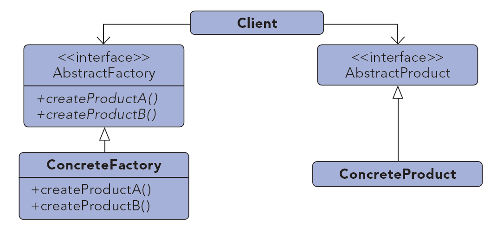
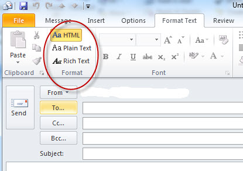

# Abstract Factory #

***

**Propósito:** Proveer una interfaz para la creación de familias o objetos dependientes relacionados, sin especificar sus clases concretas.

**Qué es**:
Es una jerarquía que encapsula muchas familias posibles y la creación de un conjunto de productos. 
El objeto "fábrica" tiene la responsabilidad de proporcionar servicios de creación para toda una familia de productos. 
Los "clientes" nunca crean directamente los objetos de la familia, piden a la fábrica que los cree por ellos.

**Lo usamos:**

  * Cuando tenemos una o múltiples familias de productos.
  * Cuando tenemos muchos objetos que pueden ser cambiados o agregados durante el tiempo de ejecución.
  * Cuando queremos obtener un objeto compuesto de otros objetos, los cuales desconocemos a que clase pertenecen.
  * Para encapsular la creación de objetos del sistema que los utiliza.
  * Las bibliotecas deberian ser publicada sin exponer los detalles de la implementación.

**Ejemplo:**

Los editores de email tienen diversos formatos: plain text, rich text, HTML.

***

License: [CC-BY](https://creativecommons.org/licenses/by/3.0/)
*Santiago Duque Rodríguez*