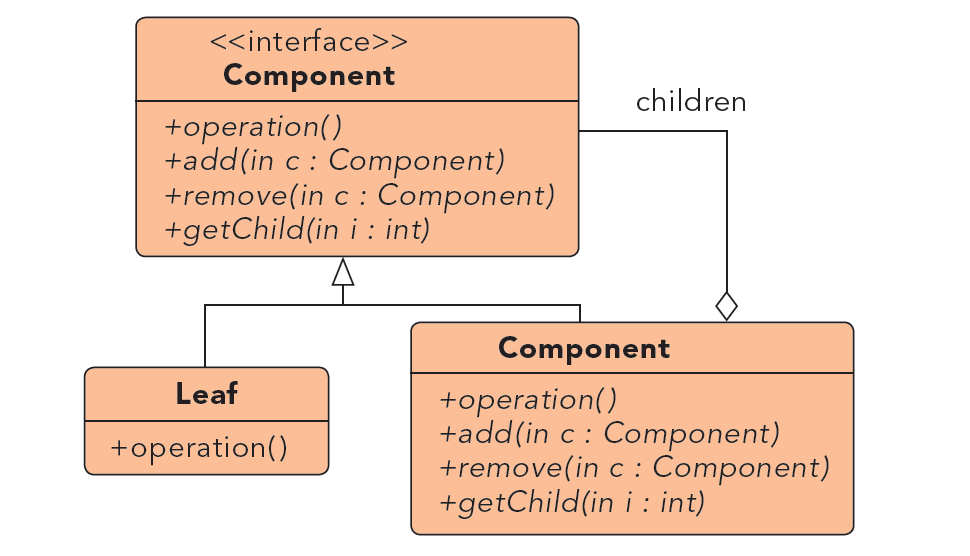
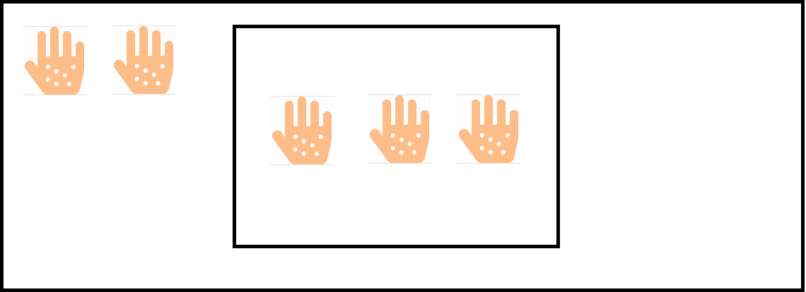

# Composite #

***

**Propósito:** Componer objetos en estructuras de árbol que representan jerarquías de un todo y sus partes. Composite provee a los clientes un mismo trato para todos los objetos que forman la jerarquía.

**Qué es**:
Es una estructura en forma de árbol que  sirve para construir objetos complejos a partir de otros más simples y similares entre sí, gracias a la composición recursiva.

**Lo usamos:**

  * Cuando queremos representar jerarquías de objetos compuestas por un todo y sus partes.
  * Se quiere que los clientes ignoren la diferencia entre la composición de objetos y su uso individual.

**Ejemplo:**

Tenemos iconos y contenedores de iconos los iconos se muestran con un metodo Show(). Los contenedores guardan iconos pero los iconos no pueden contener a nada más.

***

License: [CC-BY](https://creativecommons.org/licenses/by/3.0/)
*Santiago Duque Rodríguez*