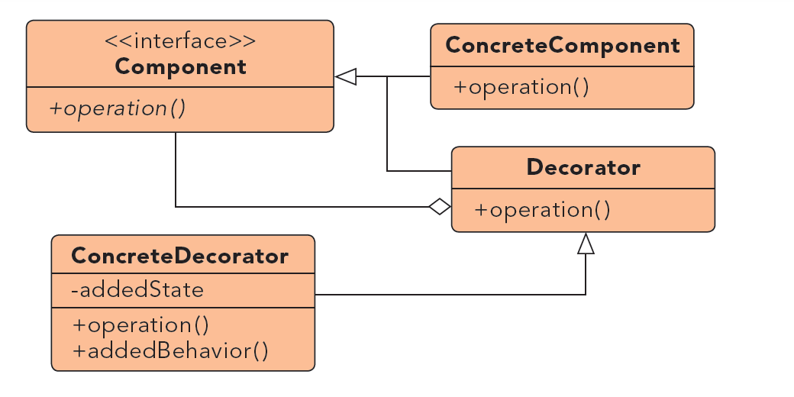

# Decorator #

***

**Propósito:** Proveer una interfaz para la creación de familias o objetos dependientes relacionados, sin especificar sus clases concretas.

**Qué es**:
Es una manera extender la funcionalidad de los objetos, aunque se puede hacer de forma estática en 
nuestro código (tiempo de compilación) mediante el uso de la herencia, sin embargo, 
podría ser necesario extender la funcionalidad de un objeto de manera dinámica.

**Lo usamos:**

	* Cuando necesitamos añadir o eliminar dinámicamente las responsabilidades a un objeto, sin afectar a otros objetos.
	* Cuando queremos tener las ventajas de la Herencia pero ncesitemos añadir funcionalidad durante el tiempo de ejecución. Es más flexible que la Herencia,
	* Simplificar el código agregando funcionalidades usando muchas clases diferentes.
	* Evitar sobreescribir código viejo agregando código nuevo.

**Ejemplo:**

Queremos obtener los bytes del contenido de un fichero. Pero nuestro sistema de fichero trabaja con elementos en zip, cifrados y planos. 
Cada fichero puede tener una combinacion de cualquiera de los tres elementos. E.g. Un fichero cifrado y zipeado, un fichero cifrado, un fichero zipeado y cifrado.... 

***

License: [CC-BY](https://creativecommons.org/licenses/by/3.0/)
*Santiago Duque Rodríguez*