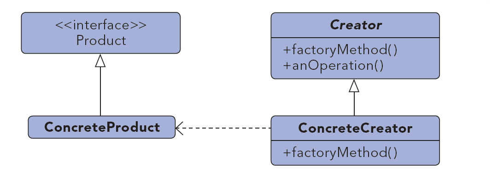

# Factory Method #

***

**Propósito:** Exponer un método para la creación de objetos, permitiendo a las subclases controlar el proceso actual de creación

**Lo usamos:**

  * Una clase no conoce que clases van a ser requeridas para su creación
  * Subclases pueden especificar que objetos deberian se creados.
  * Las clases padres delegan la creación a las subclases.

**Ejemplo:**

Tenemos diferentes solicitudes(de eventos, datos...) y para ello necesitamos distintas creaciones.

***

License: [CC-BY](https://creativecommons.org/licenses/by/3.0/)
*Santiago Duque Rodríguez*