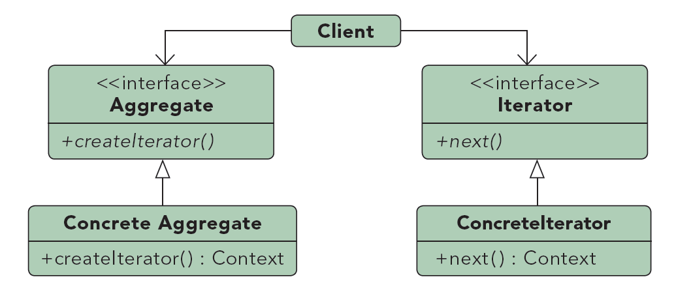

# Iterator #

***

**Propósito:** 
Permite el acceso a elementos de una agrupación de objetos sin conocer su representación interna interna.

**Qué es**:
Es una manera sencilla de poder acceder a los elementos de un contenedor sin conocer su estructura itnerna.

**Lo usamos:**

	* Para acceder al contenido de un agregado sin exponer su representación interna
	* Para permitir varios recorridos sobre un agregado
	* Para proporcionar una interfaz uniforme para recorrer distintos tipos de agregados (es decir, para permitir iteración polimórfica)

**Ejemplo:**

Recorrer una coleccion de objetos.

***

License: [CC-BY](https://creativecommons.org/licenses/by/3.0/)
*Santiago Duque Rodríguez*