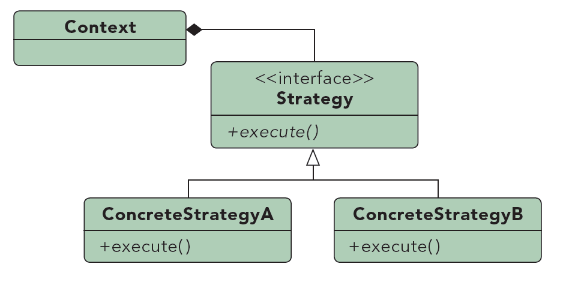

# Strategy #

***

**Propósito:** Definir una familia de algoritmos, encapsular cada uno, y que sean intercambiables. Strategy permite al algoritmo variar independientemente de los clientes que lo utilizan.

**Lo usamos:**

* Definir una familia de comportamientos.
* Definir variantes de un mismo algoritmo.
* Poder cambiar el comportamiento en tiempo de ejecución, es decir, dinámicamente.
* Reducir largas listas de condicionales.
* Evitar código duplicado.
* Ocultar código complicado, o que no queremos revelar, del usuario.

**Ejemplo:**

Comparador

***

License: [CC-BY](https://creativecommons.org/licenses/by/3.0/)
*Santiago Duque Rodríguez*